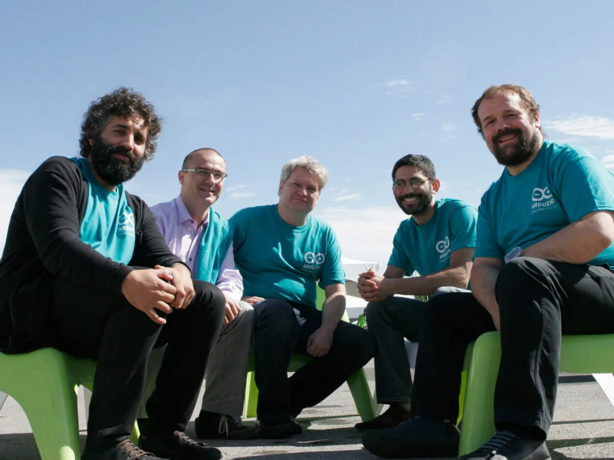
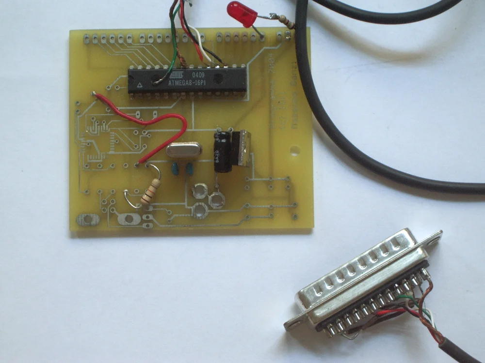
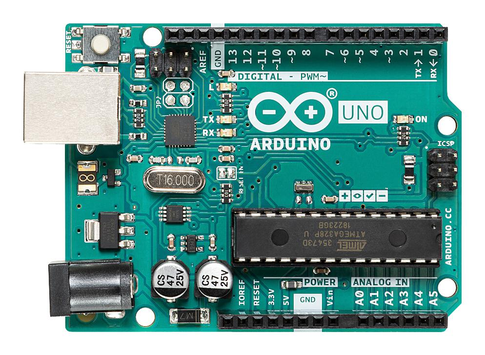

آردوینو (Arduino) یک پلتفرم متن‌باز برای توسعه پروژه‌های الکترونیکی و سیستم‌های تعاملی است که از دو بخش اصلی تشکیل می‌شود:

- سخت‌افزار مبتنی بر میکروکنترلر
- محیط توسعه نرم‌افزار (Arduino IDE)

بردهای آردوینو امکان دریافت داده از سنسورها، پردازش آن‌ها و کنترل تجهیزات مختلف را فراهم می‌کنند. به کمک آن می‌توان پروژه‌هایی مثل:

- سیستم‌های هوشمند
- ربات‌ها
- ابزارهای IoT
- کنترل موتور
- اتوماسیون خانگی
- پروژه‌های آموزشی و نمونه‌سازی سریع

را پیاده‌سازی کرد.

سادگی راه‌اندازی، مستندات گسترده و اکوسیستم بزرگ ماژول‌ها باعث شده آردوینو به یکی از استانداردهای رایج در دنیای Makerها و Prototype تبدیل شود.

## معماری کلی آردوینو

تقریباً تمام بردهای آردوینو شامل بخش‌های زیر هستند:

- میکروکنترلر اصلی
- پایه‌های ورودی و خروجی دیجیتال (GPIO)
- ورودی‌های آنالوگ
- مدار تغذیه
- مبدل USB به Serial
- کریستال کلاک
- هدرهای اتصال ماژول‌ها و شیلدها

برنامه‌ها معمولاً با زبان مبتنی بر C/C++ نوشته شده و از طریق USB روی برد آپلود می‌شوند.

# تاریخچه

پروژه Arduino در سال 2005 در مؤسسه [Interaction Design Institute Ivrea](https://interactionivrea.org/en/index.asp) ایتالیا شکل گرفت. هدف اصلی این پروژه ارائه بستری ارزان، ساده و در دسترس برای دانشجویان طراحی تعاملی بود تا بتوانند بدون نیاز به تجهیزات تخصصی، نمونه‌های اولیه سخت‌افزاری تولید کنند.

*تیم اصلی  سازندگان آردوینو — از چپ به راست:
 دیوید کوارتییِس (David Cuartielles)
 ، جیانلوکا مارتینو (Gianluca Martino)
 ، تام آیگو (Tom Igoe)
 ، دیوید ملیس (David Mellis)
  و ماسیمو بانزی (Massimo Banzi)*

در آن زمان بسیاری از بردهای توسعه موجود:

- قیمت بالایی داشتند
- راه‌اندازی پیچیده‌ای داشتند
- نیازمند ابزارهای تخصصی بودند

آردوینو با ارائه سخت‌افزار و نرم‌افزار متن‌باز این روند را تغییر داد. همین موضوع باعث شد جامعه بزرگی از توسعه‌دهندگان، سازندگان و تولیدکنندگان ماژول حول این اکوسیستم شکل بگیرد.

*اولین برد نمونهٔ اولیه که در سال ۲۰۰۵ ساخته شد، طراحی ساده‌ای داشت و هنوز آردوینو (Arduino) نامیده نمی‌شد.*

امروزه Arduino علاوه بر استفاده آموزشی، در بسیاری از پروژه‌های صنعتی سبک، سیستم‌های Embedded و نمونه‌سازی سریع نیز استفاده می‌شود.

# مدل‌های مختلف آردوینو

بردهای Arduino در مدل‌های مختلفی تولید می‌شوند که هرکدام برای کاربرد مشخصی طراحی شده‌اند. تفاوت اصلی آن‌ها معمولاً در موارد زیر است:

- نوع میکروکنترلر
- تعداد GPIO
- حافظه Flash و SRAM
- تعداد رابط‌های ارتباطی
- ابعاد فیزیکی
- ولتاژ کاری
- توان پردازشی

## آردوینو Uno

Arduino Uno شناخته‌شده‌ترین و پراستفاده‌ترین برد این خانواده است و معمولاً به عنوان استاندارد آموزشی آردوینو شناخته می‌شود.

#### ویژگی‌ها

- مبتنی بر ATmega328P
- ولتاژ کاری 5V
- مناسب برای اکثر پروژه‌های عمومی
- پشتیبانی گسترده در کتابخانه‌ها و آموزش‌ها

#### کاربردها

- یادگیری برنامه‌نویسی Embedded
- کار با سنسورها
- کنترل LED و رله
- پروژه‌های ساده رباتیک

## آردوینو Nano

Nano از نظر سخت‌افزاری بسیار نزدیک به Uno است اما در ابعاد کوچک‌تر طراحی شده است.

#### ویژگی‌ها

- ابعاد فشرده
- قابل استفاده روی Breadboard
- مناسب پروژه‌های کوچک و قابل حمل

#### کاربردها

- پروژه‌های کم‌حجم
- سیستم‌های قابل حمل
- نصب دائمی داخل باکس یا دستگاه

## آردوینو Mega

Arduino Mega برای پروژه‌هایی طراحی شده که به تعداد زیادی پایه یا حافظه بیشتر نیاز دارند.

#### ویژگی‌ها

- مبتنی بر ATmega2560
- تعداد زیاد GPIO
- چندین پورت UART
- حافظه بیشتر نسبت به Uno

#### کاربردها

- پرینتر سه‌بعدی
- CNC
- ربات‌های پیچیده
- پروژه‌های دارای چندین سنسور و ماژول

## آردوینو Leonardo

در Leonardo از میکروکنترلری استفاده شده که قابلیت USB داخلی دارد.

#### ویژگی‌ها

- شناسایی مستقیم به عنوان USB Device
- امکان شبیه‌سازی Keyboard و Mouse
- مناسب پروژه‌های HID

#### کاربردها

- ساخت ماکروپد
- کنترلر سفارشی
- ابزارهای USB

## آردوینو Due

Arduino Due نسبت به بردهای کلاسیک AVR قدرت پردازشی بیشتری ارائه می‌دهد.

#### ویژگی‌ها

- مبتنی بر ARM Cortex-M3
- پردازنده 32 بیتی
- فرکانس کاری بالاتر
- عملکرد سریع‌تر

#### نکته مهم

این برد با ولتاژ 3.3V کار می‌کند و اتصال مستقیم برخی ماژول‌های 5V ممکن است به آن آسیب بزند.

# مقایسه

| مدل | میکروکنترلر | ولتاژ کاری | ویژگی شاخص | مناسب برای |
|---|---|---|---|---|
| آردوینو Uno | ATmega328P | 5V | برد استاندارد آموزشی | شروع و پروژه‌های عمومی |
| آردوینو Nano | ATmega328P | 5V | ابعاد کوچک | پروژه‌های فشرده |
| آردوینو Mega | ATmega2560 | 5V | GPIO و حافظه بیشتر | پروژه‌های بزرگ |
| آردوینو Leonardo | ATmega32U4 | 5V | USB داخلی | پروژه‌های HID |
| آردوینو Due | ARM Cortex-M3 | 3.3V | پردازنده 32 بیتی | پردازش سنگین‌تر |

# انتخاب برد مناسب

انتخاب برد مناسب به نیاز پروژه بستگی دارد:

- اگر تازه شروع کرده‌اید: `Arduino Uno`
- اگر محدودیت فضا دارید: `Arduino Nano`
- اگر به پایه‌های زیاد نیاز دارید: `Arduino Mega`
- اگر پروژه USB می‌سازید: `Arduino Leonardo`
- اگر توان پردازشی بالاتر لازم دارید: `Arduino Due`
