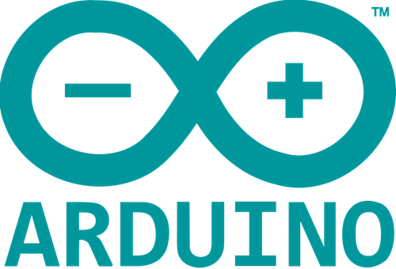
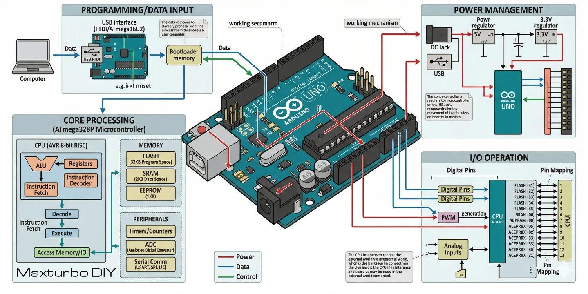
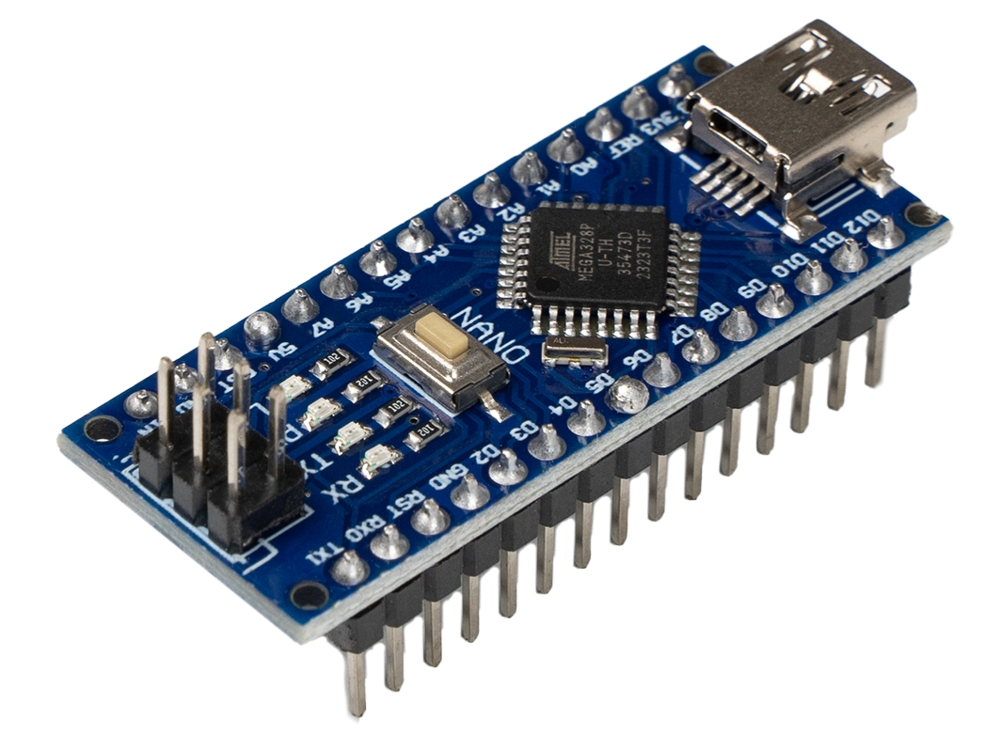
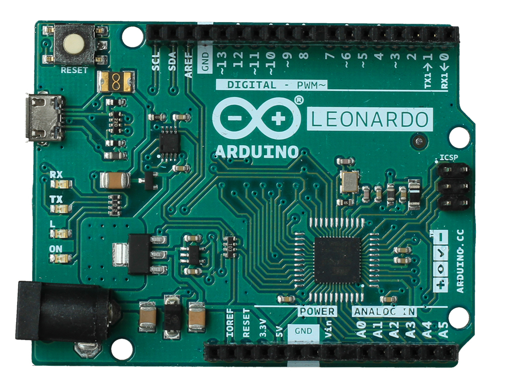
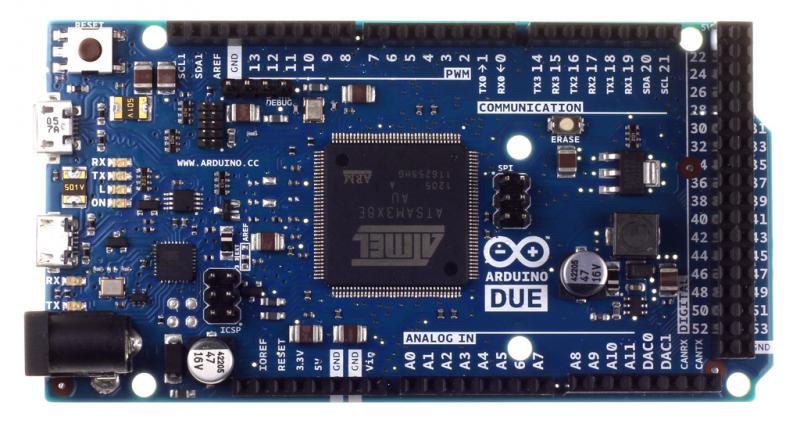

import { LinkCard } from '@astrojs/starlight/components';

---

آردوینو (Arduino) یک پلتفرم متن‌باز برای توسعه پروژه‌های الکترونیکی و سیستم‌های تعاملی است که از دو بخش اصلی تشکیل می‌شود:
سخت‌افزار مبتنی بر میکروکنترلر و محیط توسعه نرم‌افزار (Arduino IDE).
بردهای آردوینو امکان دریافت داده از سنسورها، پردازش آن‌ها و کنترل تجهیزات مختلف را فراهم می‌کنند. به کمک آن می‌توان پروژه‌هایی مثل:
سیستم‌های هوشمند ،ربات‌ها ،ابزارهای IoT ،کنترل موتور ،اتوماسیون خانگی ،پروژه‌های آموزشی و نمونه‌سازی سریع را پیاده‌سازی کرد.
سادگی راه‌اندازی، مستندات گسترده و اکوسیستم بزرگ ماژول‌ها باعث شده آردوینو به یکی از استانداردهای رایج در دنیای ساختنی ها و نمونه های اولیه محصول(Prototype) تبدیل شود.

پروژه Arduino در سال 2005 در مؤسسه [Interaction Design Institute Ivrea](https://interactionivrea.org/en/index.asp) ایتالیا شکل گرفت. هدف اصلی این پروژه ارائه بستری ارزان، ساده و در دسترس برای دانشجویان طراحی تعاملی (Interactive Design) بود تا بتوانند بدون نیاز به تجهیزات تخصصی، نمونه‌های اولیه سخت‌افزاری تولید کنند.

*تیم اصلی  سازندگان آردوینو — از چپ به راست:
 دیوید کوارتییِس (David Cuartielles)
 ، جیانلوکا مارتینو (Gianluca Martino)
 ، تام آیگو (Tom Igoe)
 ، دیوید ملیس (David Mellis)
  و ماسیمو بانزی (Massimo Banzi)*

در آن زمان بسیاری از بردهای توسعه، قیمت بالایی داشتند، راه‌اندازی شان پیچیده‌ بود و به ابزارهای تخصصی نیاز داشتند.
آردوینو با ارائه سخت‌افزار و نرم‌افزار متن‌باز این روند را تغییر داد. همین موضوع باعث شد جامعه بزرگی از توسعه‌دهندگان، سازندگان و تولیدکنندگان ماژول حول این اکوسیستم شکل بگیرد.

*اولین برد نمونهٔ اولیه که در سال ۲۰۰۵ ساخته شد، طراحی ساده‌ای داشت و هنوز آردوینو (Arduino) نامیده نمی‌شد.*

امروزه Arduino علاوه بر استفاده آموزشی، در بسیاری از پروژه‌های صنعتی سبک، سیستم‌های Embedded و نمونه‌سازی سریع نیز استفاده می‌شود. بردهای Arduino در مدل‌های مختلفی تولید می‌شوند که هرکدام برای کاربرد مشخصی طراحی شده‌اند. تفاوت اصلی آن‌ها معمولاً در موارد زیر است:

- نوع میکروکنترلر
- تعداد GPIO
- حافظه Flash و SRAM
- تعداد رابط‌های ارتباطی
- ابعاد فیزیکی
- ولتاژ کاری
- توان پردازشی

## معماری کلی آردوینو

تقریباً تمام بردهای آردوینو شامل بخش‌های زیر هستند:

- میکروکنترلر اصلی
- پایه‌های ورودی و خروجی دیجیتال (GPIO)
- ورودی‌های آنالوگ
- مدار تغذیه
- مبدل USB به Serial
- کریستال کلاک
- هدرهای اتصال ماژول‌ها و شیلدها

برنامه‌ها معمولاً با زبان مبتنی بر C/C++ نوشته شده و از طریق USB روی برد آپلود می‌شوند.

## مدل‌های آردوینو

### آردوینو Uno

Arduino Uno شناخته‌شده‌ترین و پراستفاده‌ترین برد این خانواده است و معمولاً به عنوان استاندارد آموزشی آردوینو شناخته می‌شود.
برد آردوینو اونو بهترین گزینه برای شروع یادگیری الکترونیک و برنامه‌نویسی است. اگر این اولین تجربه شما در کار با این پلتفرم باشد، اونو مقاوم‌ترین و مناسب‌ترین بردی است که می‌توانید با آن شروع کنید. همچنین اونو پرکاربردترین و مستندترین برد در میان تمام خانواده آردوینو محسوب می‌شود.

#### ویژگی‌ها

- مبتنی بر ATmega328P
- ولتاژ کاری 5V
- مناسب برای اکثر پروژه‌های عمومی
- پشتیبانی گسترده در کتابخانه‌ها و آموزش‌ها

#### کاربردها

- یادگیری برنامه‌نویسی Embedded
- کار با سنسورها
- کنترل LED و رله
- پروژه‌های ساده رباتیک

### نسخه‌های Uno

| مدل | پردازنده | معماری | فرکانس | ارتباط بی‌سیم|
|---|---|---|---|---|
| Uno R1 | ATmega328P | 8 بیتی AVR | 16MHz | ندارد |
| Uno R2 | ATmega328P | 8 بیتی AVR | 16MHz | ندارد |
| Uno R3 | ATmega328P | 8 بیتی AVR | 16MHz | ندارد |
| Uno R4 Minima | Renesas RA4M1 | 32 بیتی ARM | 48MHz | ندارد |
| Uno R4 WiFi | Renesas RA4M1 | 32 بیتی ARM | 48MHz | Wi‑Fi / BLE | IoT و ارتباط بی‌سیم |

<LinkCard 
  title="Arduino Uno R3" 
  href="uno-r3"
	description="مطالعه مدخل در دانشنامه"
>
</LinkCard>
<LinkCard 
  title="Arduino Uno R3 SMD" 
  href="uno-r3"
	description="مطالعه مدخل در دانشنامه"
>
</LinkCard>

---

### آردوینو Nano

Nano از نظر سخت‌افزاری بسیار نزدیک به Uno است اما در ابعاد کوچک‌تر طراحی شده است.

#### ویژگی‌ها

- ابعاد فشرده
- قابل استفاده روی بردبورد
- مناسب پروژه‌های کوچک و قابل حمل

#### کاربردها

- پروژه‌های کم‌حجم
- سیستم‌های قابل حمل
- نصب دائمی داخل باکس یا دستگاه

---

### آردوینو Mega

Arduino Mega برای پروژه‌هایی طراحی شده که به تعداد زیادی پایه یا حافظه بیشتر نیاز دارند.

#### ویژگی‌ها

- مبتنی بر ATmega2560
- تعداد زیاد GPIO
- چندین پورت UART
- حافظه بیشتر نسبت به Uno

#### کاربردها

- پرینتر سه‌بعدی
- CNC
- ربات‌های پیچیده
- پروژه‌های دارای چندین سنسور و ماژول

---

### آردوینو Leonardo

در Leonardo از میکروکنترلری استفاده شده که قابلیت USB داخلی دارد.

#### ویژگی‌ها

- شناسایی مستقیم به عنوان USB Device
- امکان شبیه‌سازی Keyboard و Mouse
- مناسب پروژه‌های HID

#### کاربردها

- ساخت ماکروپد
- کنترلر سفارشی
- ابزارهای USB

---

### آردوینو Due

Arduino Due نسبت به بردهای کلاسیک AVR قدرت پردازشی بیشتری ارائه می‌دهد.

#### ویژگی‌ها

- مبتنی بر ARM Cortex-M3
- پردازنده 32 بیتی
- فرکانس کاری بالاتر
- عملکرد سریع‌تر

#### نکته مهم

این برد با ولتاژ 3.3V کار می‌کند و اتصال مستقیم برخی ماژول‌های 5V ممکن است به آن آسیب بزند.

## مقایسه مدل های آردوینو

| مدل | میکروکنترلر | ولتاژ کاری | ویژگی شاخص | مناسب برای |
|---|---|---|---|---|
| آردوینو Uno | ATmega328P | 5V | برد استاندارد آموزشی | شروع و پروژه‌های عمومی |
| آردوینو Nano | ATmega328P | 5V | ابعاد کوچک | پروژه‌های فشرده |
| آردوینو Mega | ATmega2560 | 5V | GPIO و حافظه بیشتر | پروژه‌های بزرگ |
| آردوینو Leonardo | ATmega32U4 | 5V | USB داخلی | پروژه‌های HID |
| آردوینو Due | ARM Cortex-M3 | 3.3V | پردازنده 32 بیتی | پردازش سنگین‌تر |

### انتخاب برد مناسب

انتخاب برد مناسب به نیاز پروژه بستگی دارد:

- اگر تازه شروع کرده‌اید: `Arduino Uno`
- اگر محدودیت فضا دارید: `Arduino Nano`
- اگر به پایه‌های زیاد نیاز دارید: `Arduino Mega`
- اگر پروژه USB می‌سازید: `Arduino Leonardo`
- اگر توان پردازشی بالاتر لازم دارید: `Arduino Due`

## تحریم ایران
متاسفانه 
[سایت اصلی پروژه آردوینو](https://www.arduino.cc/)
و 
[زیر دامنه مستندات](https://docs.arduino.cc/)
برای دسترسی کاربران ایرانی مسدود شده است و این منابع به طور مستقیم برای ایرانیان داخل کشور قابل دسترسی نیستند.

## برد های موجود در بازار ایران

در بازار ایران انواع مختلفی از برد های آردوینو عرضه می‌شود. از نظر عملکرد کلی، اکثر این بردها مشابه هستند، اما از نظر سازنده، کیفیت ساخت و برخی جزئیات سخت‌افزاری ممکن است تفاوت‌هایی داشته باشند.

### نسخه اصلی

نسخه اصلی Arduino توسط
[شرکت **Arduino**](https://docs.arduino.cc/)
تولید می‌شود و معمولاً با عنوان `Made in Italy` یا `Made in EU` شناخته می‌شود. این بردها دارای کیفیت ساخت بالا، کنترل کیفیت دقیق و سازگاری کامل با استانداردهای رسمی Arduino هستند.
ویژگی‌های این نسخه:

- تولید شده توسط شرکت Arduino
- استفاده از قطعات با کیفیت بالا
- سازگاری کامل با مستندات رسمی
- قیمت بالاتر نسبت به نسخه‌های دیگر

این نسخه‌ها در بازار ایران کمتر دیده می‌شوند و معمولاً قیمت بالاتری دارند.

### نسخه‌های کپی

بخش عمده بردهای موجود در بازار ایران **کپی‌های چینی** هستند. این بردها توسط تولیدکنندگان مختلف در چین ساخته می‌شوند و معمولاً با نام‌هایی مثل **UNO R3** یا **Arduino Compatible** عرضه می‌شوند. از نظر عملکرد، این بردها در بیشتر پروژه‌های آموزشی و ساختنی ها کاملاً مشابه نسخه اصلی کار می‌کنند.
ویژگی‌های رایج این نسخه‌ها:

- تولید توسط شرکت‌های مختلف در چین
- قیمت پایین‌تر نسبت به نسخه اصلی
- در اغلب موارد استفاده از همان میکروکنترلر `ATmega328P`
- ممکن است از چیپ‌های مختلف برای تبدیل **USB به Serial** استفاده کنند

### تفاوت‌ بردهای چینی با برد اصلی

اگرچه اکثر بردهای کپی عملکرد مشابهی دارند، اما ممکن است برخی تفاوت‌ها وجود داشته باشد:

1. **چیپ USB به Serial**:
در نسخه اصلی از `ATmega16U2` استفاده می‌شود. در برخی نسخه‌های چینی ممکن است از چیپ‌هایی مانند `CH340`  یا `CP2102` استفاده شود. در این حالت ممکن است لازم باشد در برخی سیستم‌عامل‌ها درایور جداگانه نصب شود.

2. **کیفیت قطعات**:
در نسخه‌های چینی ممکن است کیفیت برخی قطعات پایین‌تر باشد، مانند: رگولاتور ولتاژ، کانکتور USB، کریستال یا رزوناتور، کیفیت PCB. با این حال در بسیاری از موارد این تفاوت در پروژه‌های معمولی مشکل خاصی ایجاد نمی‌کند.

3. **کیفیت مونتاژ**:
در بعضی بردها ممکن است کیفیت لحیم‌کاری یا چیدمان قطعات متفاوت باشد، زیرا تولیدکنندگان مختلفی آن‌ها را می‌سازند.

4. **برند و مارک برد**:
چینی‌ها ممکن است با برندهای مختلف یا بدون برند عرضه شوند و معمولاً لوگوی رسمی Arduino روی آن‌ها وجود ندارد.

### آیا استفاده از نسخه‌های چینی مشکلی ایجاد می‌کند؟

برای اکثر پروژه‌های آموزشی و نمونه‌سازی، نسخه‌های چینی کاملاً قابل استفاده هستند و بسیاری از کاربران از آن‌ها استفاده می‌کنند. با این حال اگر پروژه نیاز به پایداری بالا، کیفیت صنعتی یا پشتیبانی رسمی داشته باشد، استفاده از نسخه اصلی توصیه می‌شود اگرچه به طور کلّی نمی توان نسخه های چینی را ناپایدار یا بی کیفیت دانست.

