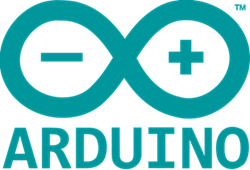
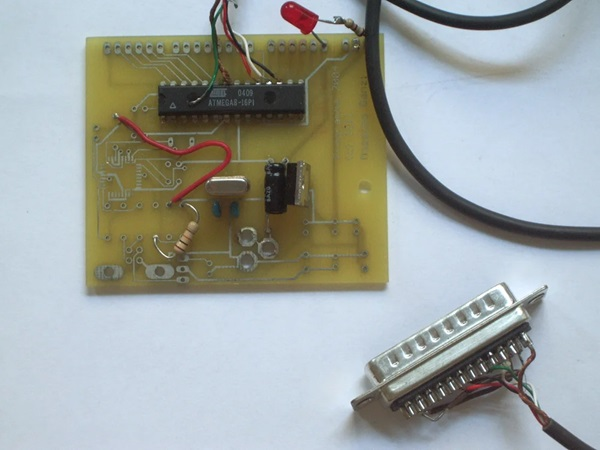
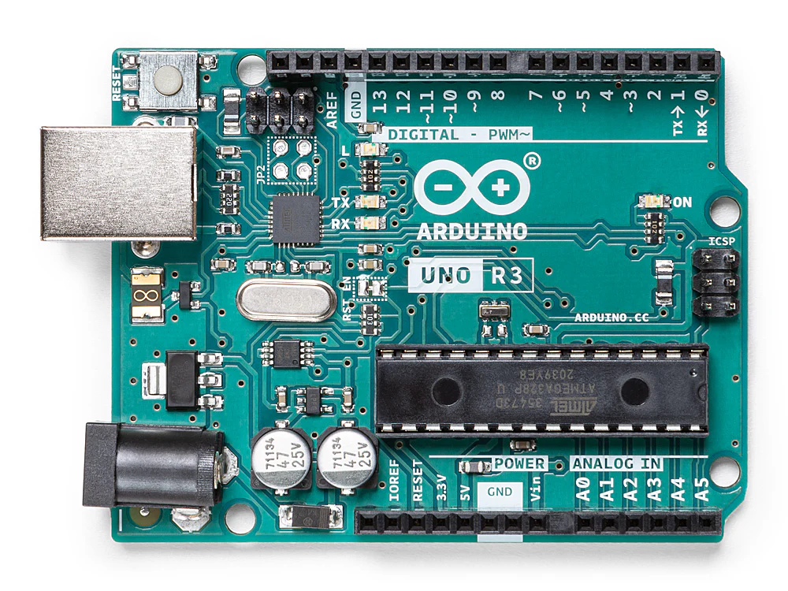
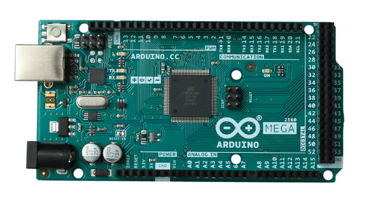

import product01 from './assets/products/arduino-smd+cable.json'
import { Aside } from '@astrojs/starlight/components';
import { Steps } from '@astrojs/starlight/components';
import { LinkCard } from '@astrojs/starlight/components';

اگه الان اینجایی، احتمالاً یه زمانی به یه وسیله‌ی الکترونیکی نگاه کردی و از خودت پرسیدی:
«این چطور کار می‌کنه؟» یا حتی بهتر از اون: «می‌تونم همچین چیزی بسازم؟»

{/*  */}

<Aside type='note' title='آره، می‌تونی!'>
</Aside>

آردوینو یه راه فوق‌العاده برای شروع این مسیر محسوب می‌شه. این یه **پلتفرم عالی برای تمرین و یادگیری**ه؛ هم در برنامه‌نویسی و هم در الکترونیک.
علاوه بر اون، کلی **ساعت سرگرمی و لذت** با پروژه‌های رباتیک و الکترونیک برات می‌سازه (که همیشه هم حال می‌ده 😊).

خیلی‌ها فکر می‌کنن آردوینو فقط یه برد آبی کوچیکه با چندتا قطعه روش. خب، یه جورایی درست می‌گن … ولی تعریف دقیق‌ترش گسترده‌تره:

<Aside type="note">
آردوینو یه **پلتفرم متن‌باز الکترونیک** هست که بر پایه‌ی سخت‌افزار و نرم‌افزار ساده و قابل استفاده ساخته شده.
</Aside>

دقت کن گفتیم «پلتفرم»، نه فقط «برد». چون آردوینو از دو بخش تشکیل شده که باید با هم کار کنن:

1. **سخت‌افزار (بُرد):** بخش فیزیکی، همون برد الکترونیکی که می‌تونی لمسش کنی و روی اون چراغ‌ها، موتور‌ها و سنسورها رو وصل می‌کنیم.
2. **نرم‌افزار (IDE، کتابخانه‌ها، فریمور):** همه‌ی نرم‌افزارهایی که به ما اجازه می‌دن دستورهایی بنویسیم تا برد اون‌ها رو اجرا کنه.

<Aside type="tip">
اینجا یکی از بهترین ویژگی‌های آردوینو خودش رو نشون می‌ده:
تو همزمان **الکترونیک و برنامه‌نویسی** یاد می‌گیری، اون هم در حالی که داری از پروژه ساختن لذت می‌بری 😊.
</Aside>
بردهای آردوینو امکان دریافت داده از سنسورها، پردازش آن‌ها و کنترل تجهیزات مختلف را فراهم می‌کنند. به کمک آن می‌توان پروژه‌هایی مثل:
سیستم‌های هوشمند ،ربات‌ها ،ابزارهای IoT ،کنترل موتور ،اتوماسیون خانگی ،پروژه‌های آموزشی و نمونه‌سازی سریع را پیاده‌سازی کرد.
سادگی راه‌اندازی، مستندات گسترده و اکوسیستم بزرگ ماژول‌ها باعث شده آردوینو به یکی از استانداردهای رایج در دنیای ساختنی ها و نمونه های اولیه محصول(Prototype) تبدیل شود.

پروژه Arduino در سال 2005 در مؤسسه [Interaction Design Institute Ivrea](https://interactionivrea.org/en/index.asp) ایتالیا شکل گرفت. هدف اصلی این پروژه ارائه بستری ارزان، ساده و در دسترس برای دانشجویان طراحی تعاملی (Interactive Design) بود تا بتوانند بدون نیاز به تجهیزات تخصصی، نمونه‌های اولیه سخت‌افزاری تولید کنند.

*تیم اصلی  سازندگان آردوینو — از چپ به راست:
 دیوید کوارتییِس (David Cuartielles)
 ، جیانلوکا مارتینو (Gianluca Martino)
 ، تام آیگو (Tom Igoe)
 ، دیوید ملیس (David Mellis)
  و ماسیمو بانزی (Massimo Banzi)*

<Aside type="caution" title="مسأله اصلی">
در آن زمان بسیاری از بردهای توسعه، قیمت بالایی داشتند، راه‌اندازی شان پیچیده‌ بود و به ابزارهای تخصصی نیاز داشتند.
</Aside>

آردوینو با ارائه سخت‌افزار و نرم‌افزار متن‌باز این روند را تغییر داد. همین موضوع باعث شد جامعه بزرگی از توسعه‌دهندگان، سازندگان و تولیدکنندگان ماژول حول این اکوسیستم شکل بگیرد.

*اولین برد نمونهٔ اولیه که در سال ۲۰۰۵ ساخته شد، طراحی ساده‌ای داشت و هنوز آردوینو (Arduino) نامیده نمی‌شد.*

امروزه Arduino علاوه بر استفاده آموزشی، در بسیاری از پروژه‌های صنعتی سبک، سیستم‌های Embedded و نمونه‌سازی سریع نیز استفاده می‌شود. بردهای Arduino در مدل‌های مختلفی تولید می‌شوند که هرکدام برای کاربرد مشخصی طراحی شده‌اند.

<Aside title="فقط برای پروژه‌های کوچک؟">

آردوینو انعطاف‌پذیر و قابل اعتماده. پس چرا گفتیم بیشتر برای پروژه‌های کوچک؟ چرا برای کاربردهای تجاری یا صنعتی نه؟

جواب کوتاه اینه که در **محیط‌های صنعتی، مسئله‌ی پایداری و قابل تکیه بودن خیلی مهمه**. اگر قرار باشه یه دستگاه خیلی گرون در کارخانه کنترل بشه، معمولاً از تجهیزات صنعتی استفاده می‌کنن که در برابر نویز الکتریکی (و ضربه‌ها) مقاوم باشن و پشتشون هم پشتیبانی فنی رسمی وجود داشته باشه.

اما این **به این معنی نیست که یاد گرفتن آردوینو فقط یه سرگرمیه**. هر چیزی که اینجا درباره‌ی الکترونیک، اتوماسیون، برنامه‌نویسی و مخابرات یاد بگیری، بعداً می‌تونی مستقیم تو کار با کنترلرهای صنعتی حرفه‌ای هم ازش استفاده کنی.

</Aside>

## معماری کلی آردوینو
---

تقریباً تمام بردهای آردوینو شامل بخش‌های زیر هستند:

- میکروکنترلر اصلی
- پایه‌های ورودی و خروجی دیجیتال (GPIO)
- ورودی‌های آنالوگ
- مدار تغذیه
- مبدل USB به Serial
- کریستال کلاک
- هدرهای اتصال ماژول‌ها و شیلدها

برنامه‌ها معمولاً با زبان مبتنی بر C/C++ نوشته شده و از طریق USB روی برد آپلود می‌شوند.

### میکروکنترلر

اگه به یه برد آردوینو نگاه کنی، یه چیپ سیاه کشیده (یا تو بعضی نسخه‌ها یه مربع کوچیک) با تعداد زیادی پایه می‌بینی.

<Aside type="caution">
اون چیپ همون **میکروکنترلر** هست و در واقع **مغز آردوینو** محسوب می‌شه.
</Aside>

میکروکنترلر در اصل **یه کامپیوتر کوچیکه که داخل یه چیپ قرار گرفته**. البته برخلاف کامپیوتر یا گوشی‌ات، این یکی خیلی (خیلی!) ضعیف‌تره.
اما در عوض، میکروکنترلر **ورودی‌هایی برای دریافت اطلاعات از محیط** (سنسورها) و **خروجی‌هایی برای انجام عمل‌ها** (عملگرها، موتور‌ها و ...) داره.  
همه‌ی این کارها هم طبق برنامه‌ای انجام می‌شه که از طریق کامپیوتر روی اون می‌ریزیم و بعد خودش به‌صورت مستقل اجراش می‌کنه.

<Steps>

1. **ورودی‌ها:** میکروکنترلر دنیا رو «می‌خونه».  
   آیا دکمه‌ای فشار داده شده؟ هوا گرمه؟ نور زیاده؟

2. **پردازش:** طبق دستورهایی که بهش دادیم (کدی که نوشتیم) تصمیم می‌گیره چی کار کنه.  
   «اگر هوا گرم بود، پس…»

3. **خروجی‌ها:** روی دنیای واقعی یه عملی انجام می‌ده.  
   مثلاً یه فن رو روشن می‌کنه، یه موتور رو حرکت می‌ده یا یه LED رو روشن می‌کنه.

</Steps>

## مدل‌های آردوینو
---
برای شروع کار با آردوینو، طبیعتاً **اولین کاری که باید بکنیم خریدن یه بُرده**. برای همین الان می‌خوایم مدل‌های مختلفی که وجود دارن رو ببینیم.
### آردوینو Uno

Arduino Uno شناخته‌شده‌ترین و پراستفاده‌ترین برد این خانواده است و معمولاً به عنوان استاندارد آموزشی آردوینو شناخته می‌شود.
برد آردوینو اونو بهترین گزینه برای شروع یادگیری الکترونیک و برنامه‌نویسی است. اگر این اولین تجربه شما در کار با این پلتفرم باشد، اونو مقاوم‌ترین و مناسب‌ترین بردی است که می‌توانید با آن شروع کنید. همچنین اونو پرکاربردترین و مستندترین برد در میان تمام خانواده آردوینو محسوب می‌شود.

<Aside type="tip">
این **مدل استاندارد**ه. اندازه‌ی مناسبی برای کار با دست داره، مقاومه و با بیشتر لوازم جانبی (Shields) سازگاره.
</Aside>

#### ویژگی‌ها

- مبتنی بر ATmega328P
- ولتاژ کاری 5V
- مناسب برای اکثر پروژه‌های عمومی
- پشتیبانی گسترده در کتابخانه‌ها و آموزش‌ها

#### کاربردها

- یادگیری برنامه‌نویسی Embedded
- کار با سنسورها
- کنترل LED و رله

#### نسخه‌ها
<LinkCard 
  title="Arduino Uno R3" 
  href="/platforms/arduino/boards/uno-r3/"
	description="مطالعه مدخل در دانشنامه"
>
</LinkCard>
<LinkCard 
  title="Arduino Uno R3 SMD" 
  href="/platforms/arduino/boards/uno-r3-smd/"
	description="مطالعه مدخل در دانشنامه"
>
</LinkCard>

#### سفارش

<LinkCard
  href={`${product01.link}?utm_source=wiki-derock`}
  title={product01.title}
  description="خرید از فروشگاه کارگاه فناوری دراک"
/>

---

### آردوینو Nano

Nano از نظر سخت‌افزاری بسیار نزدیک به Uno است اما در ابعاد کوچک‌تر طراحی شده است.

<Aside type="tip">
در اصل یه Arduino UNO **کوچیک‌شده** است. تقریباً همون قدرت رو داره ولی اندازه‌اش خیلی کوچیکه و برای وصل کردن مستقیم روی بردبورد عالیه.
</Aside>

#### ویژگی‌ها

- ابعاد فشرده
- قابل استفاده روی بردبورد
- مناسب پروژه‌های کوچک و قابل حمل

#### کاربردها

- پروژه‌های کم‌حجم
- سیستم‌های قابل حمل
- نصب دائمی داخل باکس یا دستگاه

---

### آردوینو Mega

Arduino Mega برای پروژه‌هایی طراحی شده که به تعداد زیادی پایه یا حافظه بیشتر نیاز دارند.
<Aside type="tip">
هیولا! بزرگ‌تره، حافظه‌ی بیشتری داره و ورودی و خروجی‌های خیلی بیشتری ارائه می‌ده. معمولاً تو پروژه‌های بزرگ مثل پرینتر سه‌بعدی یا ربات‌های پیچیده استفاده می‌شه.
</Aside>

#### ویژگی‌ها

- مبتنی بر ATmega2560
- تعداد زیاد GPIO
- چندین پورت UART
- حافظه بیشتر نسبت به Uno

#### کاربردها

- پرینتر سه‌بعدی
- CNC
- ربات‌های پیچیده
- پروژه‌های دارای چندین سنسور و ماژول

---

### آردوینو Leonardo

در Leonardo از میکروکنترلری استفاده شده که قابلیت USB داخلی دارد.

#### ویژگی‌ها

- شناسایی مستقیم به عنوان USB Device
- امکان شبیه‌سازی Keyboard و Mouse
- مناسب پروژه‌های HID

#### کاربردها

- ساخت ماکروپد
- کنترلر سفارشی
- ابزارهای USB

---

### آردوینو Due

Arduino Due نسبت به بردهای کلاسیک AVR قدرت پردازشی بیشتری ارائه می‌دهد.

#### ویژگی‌ها

- مبتنی بر ARM Cortex-M3
- پردازنده 32 بیتی
- فرکانس کاری بالاتر
- عملکرد سریع‌تر

<Aside type="caution">
این برد با ولتاژ 3.3V کار می‌کند و اتصال مستقیم برخی ماژول‌های 5V ممکن است به آن آسیب بزند.
</Aside>
## مقایسه مدل های آردوینو

| مدل | میکروکنترلر | ولتاژ کاری | ویژگی شاخص | مناسب برای |
|---|---|---|---|---|
| آردوینو Uno | ATmega328P | 5V | برد استاندارد آموزشی | شروع و پروژه‌های عمومی |
| آردوینو Nano | ATmega328P | 5V | ابعاد کوچک | پروژه‌های فشرده |
| آردوینو Mega | ATmega2560 | 5V | GPIO و حافظه بیشتر | پروژه‌های بزرگ |
| آردوینو Leonardo | ATmega32U4 | 5V | USB داخلی | پروژه‌های HID |
| آردوینو Due | ARM Cortex-M3 | 3.3V | پردازنده 32 بیتی | پردازش سنگین‌تر |

### انتخاب برد مناسب

انتخاب برد مناسب به نیاز پروژه بستگی دارد:

- اگر تازه شروع کرده‌اید: `Arduino Uno`
- اگر محدودیت فضا دارید: `Arduino Nano`
- اگر به پایه‌های زیاد نیاز دارید: `Arduino Mega`
- اگر پروژه هاست USB می‌سازید: `Arduino Leonardo`
- اگر توان پردازشی بالاتر لازم دارید: `Arduino Due`

<Aside type="tip">

برای شروع، **یه Arduino UNO بخرید** (مدل `R3` یا `R4`). این برد بیشترین مستندات دنیا رو داره، اتصالش ساده‌تره و معمولاً بدون دردسر کار می‌کنه.

- **Nano** رو بذار برای وقتی که می‌خوای یه مونتاژ نهایی کوچیک بسازی.
- **Mega** رو هم فقط وقتی لازم داری که پروژه‌ات واقعاً از نظر تعداد پایه کم بیاره (که معمولاً مدتی طول می‌کشه تا به اونجا برسی).
</Aside>

## تحریم ایران
---

متاسفانه 
[سایت اصلی پروژه آردوینو](https://www.arduino.cc/)
و 
[زیر دامنه مستندات](https://docs.arduino.cc/)
برای دسترسی کاربران ایرانی مسدود شده است و این منابع به طور مستقیم برای ایرانیان داخل کشور قابل دسترسی نیستند.

اکثر این مستندات و ابزارهای توسعه آردوینو توسط سایت های ایرانی برای کابران داخل کشور و تحت شبکه ملّی اطلاعات ارائه شده و قابل دسترس اند.
## برد های موجود در بازار ایران
---

در بازار ایران انواع مختلفی از برد های آردوینو عرضه می‌شود. از نظر عملکرد کلی، اکثر این بردها مشابه هستند، اما از نظر سازنده، کیفیت ساخت و برخی جزئیات سخت‌افزاری ممکن است تفاوت‌هایی داشته باشند.

### نسخه اصلی

نسخه اصلی Arduino توسط
[شرکت **Arduino**](https://docs.arduino.cc/)
تولید می‌شود و معمولاً با عنوان `Made in Italy` یا `Made in EU` شناخته می‌شود. این بردها دارای کیفیت ساخت بالا، کنترل کیفیت دقیق و سازگاری کامل با استانداردهای رسمی Arduino هستند.
ویژگی‌های این نسخه:

- تولید شده توسط شرکت Arduino
- استفاده از قطعات با کیفیت بالا
- سازگاری کامل با مستندات رسمی
- قیمت بالاتر نسبت به نسخه‌های دیگر

این نسخه‌ها در بازار ایران کمتر دیده می‌شوند و معمولاً قیمت بالاتری دارند.

### نسخه‌های کپی

بخش عمده بردهای موجود در بازار ایران **کپی‌های چینی** هستند. این بردها توسط تولیدکنندگان مختلف در چین ساخته می‌شوند و معمولاً با نام‌هایی مثل **UNO R3** یا **Arduino Compatible** عرضه می‌شوند. از نظر عملکرد، این بردها در بیشتر پروژه‌های آموزشی و ساختنی ها کاملاً مشابه نسخه اصلی کار می‌کنند.
ویژگی‌های رایج این نسخه‌ها:

- تولید توسط شرکت‌های مختلف در چین
- قیمت پایین‌تر نسبت به نسخه اصلی
- در اغلب موارد استفاده از همان میکروکنترلر `ATmega328P`
- ممکن است از چیپ‌های مختلف برای تبدیل **USB به Serial** استفاده کنند

### تفاوت‌ بردهای چینی با برد اصلی

اگرچه اکثر بردهای کپی عملکرد مشابهی دارند، اما ممکن است برخی تفاوت‌ها وجود داشته باشد:

1. **چیپ USB به Serial**:
در نسخه اصلی از `ATmega16U2` استفاده می‌شود. در برخی نسخه‌های چینی ممکن است از چیپ‌هایی مانند `CH340`  یا `CP2102` استفاده شود. در این حالت ممکن است لازم باشد در برخی سیستم‌عامل‌ها درایور جداگانه نصب شود.

2. **کیفیت قطعات**:
در نسخه‌های چینی ممکن است کیفیت برخی قطعات پایین‌تر باشد، مانند: رگولاتور ولتاژ، کانکتور USB، کریستال یا رزوناتور، کیفیت PCB. با این حال در بسیاری از موارد این تفاوت در پروژه‌های معمولی مشکل خاصی ایجاد نمی‌کند.

3. **کیفیت مونتاژ**:
در بعضی بردها ممکن است کیفیت لحیم‌کاری یا چیدمان قطعات متفاوت باشد، زیرا تولیدکنندگان مختلفی آن‌ها را می‌سازند.

4. **برند و مارک برد**:
چینی‌ها ممکن است با برندهای مختلف یا بدون برند عرضه شوند و معمولاً لوگوی رسمی Arduino روی آن‌ها وجود ندارد.

### آیا استفاده از نسخه‌های چینی مشکلی ایجاد می‌کند؟

برای اکثر پروژه‌های آموزشی و نمونه‌سازی، نسخه‌های چینی کاملاً قابل استفاده هستند و بسیاری از کاربران از آن‌ها استفاده می‌کنند. با این حال اگر پروژه نیاز به پایداری بالا، کیفیت صنعتی یا پشتیبانی رسمی داشته باشد، استفاده از نسخه اصلی توصیه می‌شود اگرچه به طور کلّی نمی توان نسخه های چینی را ناپایدار یا بی کیفیت دانست.