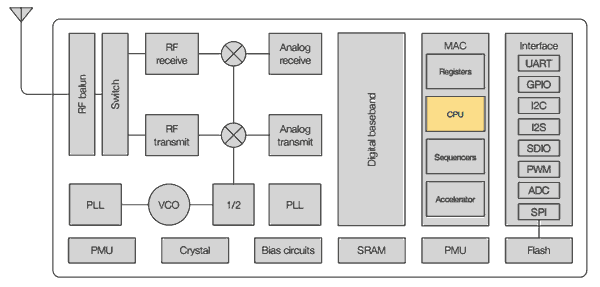
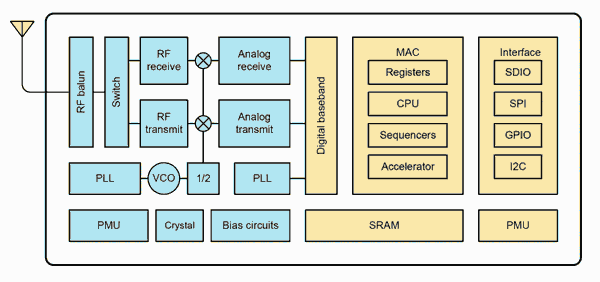

import { Aside } from '@astrojs/starlight/components';

دیگر وقتش رسیده بود که در وبلاگ درباره **ESP8266** و **ESP32** صحبت کنیم؛ دو تراشه‌ای که این روزها حسابی سر و صدا به پا کرده‌اند و جایگاه ویژه‌ای در دنیای پررونق **اینترنت اشیا (IoT)** برای خودشان پیدا کرده‌اند.

وقتی اولین ماژول‌های مجهز به ESP8266 وارد بازار شدند، خیلی از ما با خودمان گفتیم:

> «عالیه! بالاخره یک ماژول WiFi ارزان برای آردوینو پیدا شد.»

آن زمان شیلدها و راهکارهای WiFi برای آردوینو قیمت بسیار بالایی داشتند و برای بسیاری از پروژه‌ها مقرون‌به‌صرفه نبودند.

اما خیلی زود اعضای جامعه متن‌باز و سازندگان (Maker Community) متوجه شدند که این پردازنده کوچک، قابلیت‌های بسیار بیشتری از یک ماژول ساده WiFi دارد. ویژگی‌های فنی مناسب در کنار قیمت پایین باعث شد ESP8266 در مدت کوتاهی به موفقیت بزرگی دست پیدا کند.

امروزه هم **ESP8266** و هم **ESP32** از مهم‌ترین تراشه‌های دنیای اینترنت اشیا محسوب می‌شوند و هر روز بیشتر از قبل نشان می‌دهند که چرا به یکی از محبوب‌ترین گزینه‌ها برای توسعه محصولات IoT تبدیل شده‌اند.

امروزه بسیاری از محصولات تجاری بر پایه این تراشه‌ها توسعه داده می‌شوند. یکی از شناخته‌شده‌ترین نمونه‌ها، محصولات **Sonoff** از شرکت **Itead** است که امکان پیاده‌سازی سیستم‌های هوشمندسازی ساختمان را با هزینه‌ای بسیار پایین فراهم می‌کنند. طبق اعلام شرکت **Espressif**، تاکنون بیش از **۱۰۰ میلیون** واحد از این تراشه‌ها به فروش رسیده است.

اما قبل از هر چیز، بهتر است از ابتدا شروع کنیم و ببینیم اصلاً **ESP8266 چیست**. در مقاله بعدی هم با «برادر بزرگ‌تر» آن، یعنی **ESP32** آشنا خواهیم شد.

در واقع این محصول آن‌قدر مهم و جذاب است که تصمیم گرفته‌ایم بخش اختصاصی خودش را در وبلاگ داشته باشد.

---

# ESP8266 چیست؟

ESP8266 یک **SoC (System on a Chip)** یا «سیستم روی تراشه» است که توسط شرکت چینی **Espressif** تولید می‌شود.

در یک SoC، چندین بخش مختلف در قالب یک مدار مجتمع واحد کنار هم قرار می‌گیرند. مهم‌ترین اجزای ESP8266 عبارت‌اند از:

- یک پردازنده ۳۲ بیتی
- یک تراشه WiFi
- پشته کامل TCP/IP برای مدیریت ارتباطات شبکه

به زبان ساده، ESP8266 تراشه‌ای است که یک پردازنده همه‌منظوره را همراه با قابلیت کامل اتصال به شبکه WiFi، درون یک بسته واحد در اختیار شما قرار می‌دهد.

پردازنده استفاده‌شده در ESP8266 از نوع **Tensilica L106** با معماری **۳۲ بیتی RISC** است که به‌صورت پیش‌فرض با فرکانس **۸۰ مگاهرتز** کار می‌کند و در صورت نیاز می‌تواند تا **۱۶۰ مگاهرتز** نیز افزایش پیدا کند.

خود تراشه ESP8266 حافظه Flash داخلی ندارد؛ بنابراین حافظه Flash باید روی ماژولی که تراشه روی آن نصب شده است قرار داشته باشد. ارتباط این حافظه از طریق رابط **QSPI** انجام می‌شود، اما معمولاً این موضوع برای برنامه‌نویس کاملاً شفاف است و نیازی به مدیریت مستقیم آن ندارد.

نکته مهم این است که مقدار حافظه Flash به **ماژول** بستگی دارد، نه خود تراشه ESP8266. معمولاً ماژول‌هایی با حافظه **۱ تا ۸ مگابایت** در بازار دیده می‌شوند و حداکثر ظرفیت پشتیبانی‌شده **۱۶ مگابایت** است.

---

# مشخصات فنی

## پردازنده و حافظه

| مشخصه | مقدار |
| --- | --- |
| پردازنده | پردازنده ۳۲ بیتی کم‌مصرف |
| فرکانس کاری | ۸۰ مگاهرتز (حداکثر ۱۶۰ مگاهرتز) |
| حافظه RAM | ۳۲KiB برای دستورالعمل‌ها |
| | ۳۲KiB حافظه Cache |
| | ۸۰KiB حافظه داده کاربر |
| حافظه Flash | حافظه خارجی تا سقف ۱۶MiB |

## ارتباطات و استانداردها

| مشخصه | مقدار |
| --- | --- |
| WiFi | IEEE 802.11 b/g/n در باند ۲٫۴ گیگاهرتز (پشتیبانی از WPA/WPA2) |
| شبکه | پشته داخلی TCP/IP |
| گواهی‌ها | FCC، CE، TELEC، WiFi Alliance و SRRC |

## GPIO و واسط‌های جانبی

| مشخصه | مقدار |
| --- | --- |
| تعداد GPIO | ۱۶ پایه |
| PWM | روی تمام پایه‌ها (۱۰ بیتی) |
| مبدل آنالوگ به دیجیتال | ۱۰ بیتی |
| UART | دو فرستنده (TX) و یک گیرنده (RX) |
| رابط‌ها | SPI، I²C و I²S |

## تغذیه و مصرف انرژی

| مشخصه | مقدار |
| --- | --- |
| ولتاژ کاری | ۳٫۰ تا ۳٫۶ ولت |
| مصرف معمول | حدود ۸۰ میلی‌آمپر |
| حالت Standby | حدود ۱ میلی‌وات |
| حالت Deep Sleep | حدود ۱ میکروآمپر |

---

# تاریخچه ESP8266

بدون اینکه وارد جزئیات زیادی شویم، داستان ESP8266 و برادر قدرتمندتر آن، ESP32، از **اوت ۲۰۱۴** آغاز شد؛ زمانی که شرکت **AI-Thinker** اولین ماژول **ESP-01** را معرفی کرد.

در آن زمان ارتباط با ESP8266 تنها از طریق فرمان‌های **AT** انجام می‌شد. مستندات بسیار محدود بودند، بیشتر آن‌ها به زبان چینی منتشر شده بودند و همچنین SDK رسمی پیچیدگی زیادی داشت و استفاده از آن چندان ساده نبود. به همین دلیل، کاربرد عملی ESP8266 هنوز محدود به نظر می‌رسید.

اما این موضوع مانع از آن نشد که علاقه‌مندان، ظرفیت بالای این تراشه را تشخیص دهند. به‌تدریج جامعه کاربری و تولیدکنندگان مختلف فعالیت گسترده‌ای را برای توسعه ابزارها، مستندات و نرم‌افزارهای مرتبط با ESP8266 آغاز کردند.

---

در هر صورت، این محدودیت باعث نشد که علاقه‌مندان دست از کار بکشند. خیلی زود جامعه توسعه‌دهندگان و شرکت‌های مختلف شروع به کار فعال روی این تراشه کردند.

یکی از نقاط عطف مهم در تاریخ ESP8266، ظهور **NodeMCU firmware** بود؛ فریمور مشهوری که نام خودش را به یک برد توسعه نیز داده است. این فریمور امکان برنامه‌نویسی ESP8266 با زبان **Lua** را فراهم می‌کرد؛ زبانی سبک و سطح بالا که بر پایه مفاهیمی از C و Perl طراحی شده است.

پس از آن، کار جامعه متن‌باز ادامه پیدا کرد و نتیجه آن تولید مستندات، آموزش‌ها و ابزارهای مختلف بود. در نهایت به یکی از مهم‌ترین نقاط عطف رسیدیم: انتشار **SDKهای متن‌باز مبتنی بر GCC toolchain** برای ESP8266 توسط جامعه توسعه‌دهندگان.

این اتفاق باعث شد امکان برنامه‌نویسی ESP8266 در محیط **Arduino IDE** فراهم شود؛ چیزی که با نام **ESP8266 Arduino Core** شناخته می‌شود. این رویداد یک جهش بزرگ برای ESP8266 در دنیای Makerها بود، زیرا حالا این تراشه می‌توانست از اکوسیستم عظیم و قدرتمند آردوینو و جامعه بزرگ آن بهره‌مند شود.

در ادامه، شرکت **Espressif** نیز واکنش نشان داد (یا بهتر بگوییم پتانسیل این حرکت را دید و آن را پذیرفت) و SDKهای رسمی جدیدی منتشر کرد که مجوزی مشابه MIT داشتند و عملاً از جامعه توسعه‌دهندگان حمایت بیشتری به عمل آوردند.

از آن زمان به بعد، تولیدکنندگان زیادی شروع به ساخت بردهای توسعه بر پایه ESP8266 کردند. از میان معروف‌ترین آن‌ها می‌توان به **NodeMCU** و **WeMos** اشاره کرد که هرکدام نسخه‌ها و مدل‌های مختلفی دارند. در ادامه این سری آموزشی، به این بردها نیز به‌طور کامل خواهیم پرداخت.

همچنین امروزه فریمورها و SDKهای مختلفی برای برنامه‌نویسی ESP8266 وجود دارد که امکان توسعه با زبان‌های گوناگون را فراهم می‌کنند. برای مثال:

- **MicroPython** (پایتون)
- **ESPruino** (جاوااسکریپت)
- **ESP-OPEN-RTOS** (بر پایه FreeRTOS)
- **Mongoose OS**

و چندین گزینه دیگر. در آینده به این موارد نیز خواهیم پرداخت.

در سپتامبر ۲۰۱۶، تراشه **ESP32** معرفی شد؛ نسخه‌ای بسیار قدرتمندتر که بسیاری از محدودیت‌های ESP8266 را برطرف می‌کرد. اگرچه قیمت بالاتری دارد، اما اگر ESP8266 را یک تراشه قدرتمند بدانیم، ESP32 را باید یک «هیولا» واقعی در دنیای IoT دانست.

با این حال، در آن زمان پشتیبانی و مستندات ESP32 هنوز به اندازه ESP8266 گسترده نبود، اما رشد آن بسیار سریع بود. در آینده به‌صورت کامل به ESP32 و قابلیت‌های آن خواهیم پرداخت.

---

# انواع ماژول‌های ESP8266

ماژول‌های مختلفی وجود دارند که بر پایه SoC ESP8266 ساخته شده‌اند. ویژگی اصلی این ماژول‌ها در بسیاری موارد مشابه است و تفاوت اصلی آن‌ها در دو بخش دیده می‌شود:

- مقدار حافظه Flash
- فرم فیزیکی و طراحی سخت‌افزاری

این تفاوت‌ها به‌طور مستقیم روی تعداد GPIOهای در دسترس نیز تأثیر می‌گذارند.

در برخی بردها (که البته کمتر رایج هستند)، پایه‌های GPIO به‌صورت پین کامل ارائه شده‌اند و امکان لحیم‌کاری مستقیم یا اتصال ترمینال وجود دارد. اما در بیشتر موارد، ماژول‌ها به‌صورت نیمه‌پین (half-pin) طراحی شده‌اند تا روی PCBها یا بردهای توسعه به‌صورت دائمی مونتاژ شوند.

برای ساده‌سازی موضوع، می‌توان گفت دو مدل از همه رایج‌تر هستند:

- **ESP-01**
- **ESP-12 / ESP-12E**

سایر مدل‌ها کاربرد کمتری دارند و کمتر در بازار دیده می‌شوند.

## ESP-01

ماژول ESP-01 به چند دلیل بسیار محبوب شد:
- اولین مدل‌های عرضه‌شده
- اندازه بسیار کوچک
- قیمت پایین

این ماژول معمولاً برای اضافه کردن قابلیت WiFi به پروژه‌های مبتنی بر آردوینو استفاده می‌شود؛ یعنی نقش یک «WiFi Shield» را ایفا می‌کند. همان‌طور که در برخی پروژه‌ها دیده می‌شود، می‌توان از آن برای افزودن ارتباط بی‌سیم به سیستم‌های ساده استفاده کرد.

با این حال، ESP-01 محدودیت مهمی دارد: فقط **۲ پایه GPIO قابل استفاده** در اختیار شما قرار می‌دهد، بنابراین برای پروژه‌های پیچیده مناسب نیست.

## ESP-12 و ESP-12E

در مقابل، سری **ESP-12** و به‌خصوص نسخه **ESP-12E** به‌تدریج به محبوب‌ترین انتخاب در میان ماژول‌های ESP8266 تبدیل شدند. این مدل‌ها در بسیاری از بردهای توسعه و محصولات تجاری مورد استفاده قرار می‌گیرند.

این ماژول‌ها تعداد GPIO بیشتری در اختیار دارند و از نظر قابلیت‌ها نسبت به ESP-01 بسیار کامل‌تر هستند، به همین دلیل در پروژه‌های جدی‌تر و حرفه‌ای‌تر بیشتر استفاده می‌شوند.

---

در پست‌های آینده، وارد دنیای جذاب ESP8266 و ESP32 خواهیم شد؛ از معرفی بردهای توسعه گرفته تا روش‌های برنامه‌نویسی و پروژه‌های کاربردی که نشان می‌دهند این دو تراشه چگونه مسیر اینترنت اشیا را متحول کرده‌اند.

---

**موضوعات:**
- Arduino
- ESP8266
