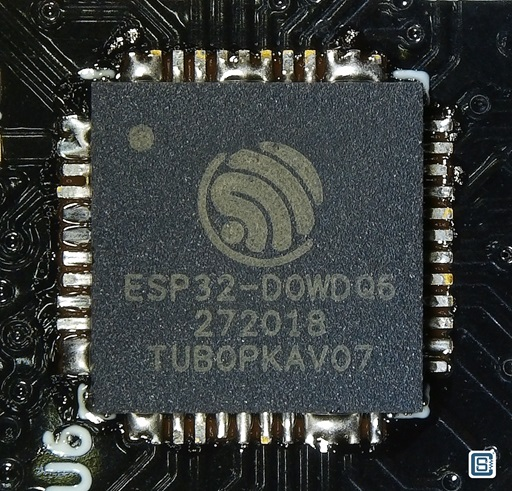
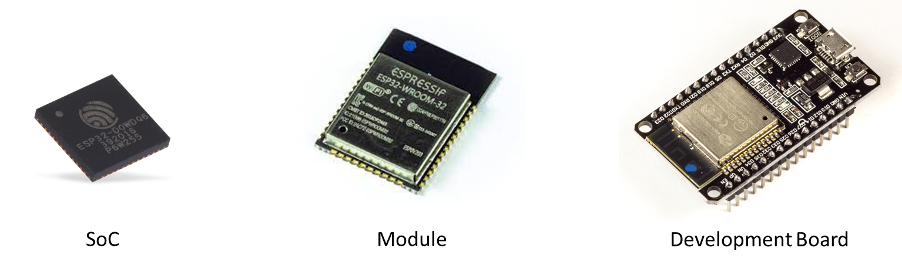

import { Aside } from '@astrojs/starlight/components';

`ESP32` یک **SoC (System on Chip)** است که توسط شرکت چینی [**اسپرسیف**](https://www.espressif.com/) طراحی شده و شرکت **TSMC** آن را تولید می‌کند. این تراشه، یک **پردازنده دو هسته‌ای ۳۲ بیتی Tensilica Xtensa** با فرکانس **۱۶۰ مگاهرتز** (با امکان افزایش تا **۲۴۰ مگاهرتز**) را به همراه **قابلیت اتصال WiFi و Bluetooth** در قالب یک تراشه واحد ادغام کرده است.

`ESP32` از بسیاری جهات نسبت به `ESP8266` برتری دارد. طبیعتاً در مقابل این امکانات بیشتر، قیمت آن نیز کمی بالاتر است. با این حال، از نظر **نسبت امکانات به قیمت**، همچنان گزینه‌ای فوق‌العاده محسوب می‌شود.

همان‌طور که انتظار می‌رفت، جامعه تولید کنندگان نیز از `ESP32` استقبال گسترده‌ای کرد. برای این تراشه فریمورها، مستندات و ابزارهای مختلفی توسعه یافته‌اند و اگرچه میزان پشتیبانی آن هنوز به گستردگی `ESP8266` نیست، اما امروزه به‌راحتی می‌توان آموزش‌ها و منابع متعددی درباره آن پیدا کرد و مقالات جدید نیز به‌طور مداوم منتشر می‌شوند.

تولیدکنندگان سخت‌افزار نیز به این روند توجه کرده‌اند و بردهای توسعه متنوعی بر پایه `ESP32` عرضه کرده‌اند. برخی از این بردها دارای **باتری LiPo** (مانند مدل‌های **16050**) هستند، برخی نمایشگر **TFT** دارند، برخی دیگر به **نمایشگر OLED** یا **ارتباط LoRa** مجهز شده‌اند و همچنان مدل‌های جدید و جذاب‌تری نیز به بازار معرفی می‌شوند.

کم‌کم شاهد انتشار مقالات و عرضه محصولات تجاری بیشتری هستیم که `ESP32` را به‌عنوان هسته اصلی خود به‌کار گرفته‌اند. البته در حال حاضر، هنوز تعداد محصولات مبتنی بر `ESP8266` بیشتر است؛ احتمالاً به دلیل قیمت پایین‌تر یا حضور طولانی‌تر آن در بازار. با این حال، ممکن است این روند در آینده تغییر کند و با توجه به **قدرت پردازشی بیشتر** و **پشتیبانی از Bluetooth BLE**، تعداد محصولات تجاری مبتنی بر `ESP32` افزایش یابد.

از نظر **زبان‌های برنامه‌نویسی** نیز گزینه‌های متعددی در دسترس هستند که تا حد زیادی مشابه گزینه‌های موجود برای `ESP8266` هستند. می‌توان از **Arduino IDE** استفاده کرد یا فریمورها و محیط‌هایی مانند [MicroPython](https://micropython.org/)، [RTOS](https://github.com/SuperHouse/esp-open-rtos)، [Mongoose OS](https://mongoose-os.com/) و [Espruino](https://www.espruino.com/) را روی آن اجرا کرد.

در مجموع، `ESP32` یک تراشه بسیار جذاب و توانمند است که امکانات فراوانی را برای توسعه انواع پروژه‌ها در اختیار شما قرار می‌دهد. به‌ویژه قابلیت‌های ارتباطی آن باعث شده است جایگاه ویژه‌ای در پروژه‌های **IoT (اینترنت اشیا)** داشته باشد. اگر به سراغ این تراشه بروید، بدون ایده برای ساخت پروژه نخواهید ماند.