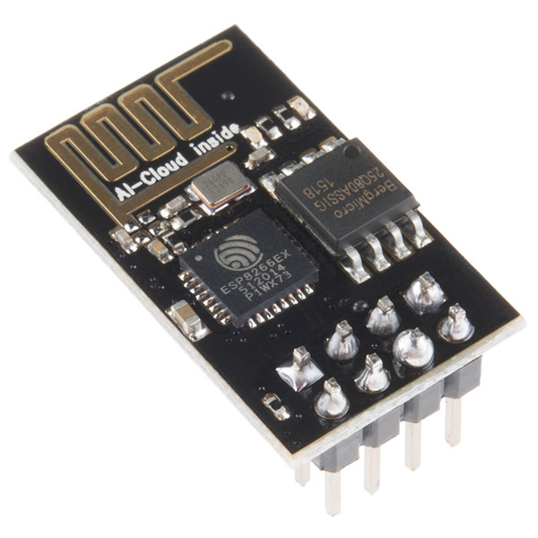
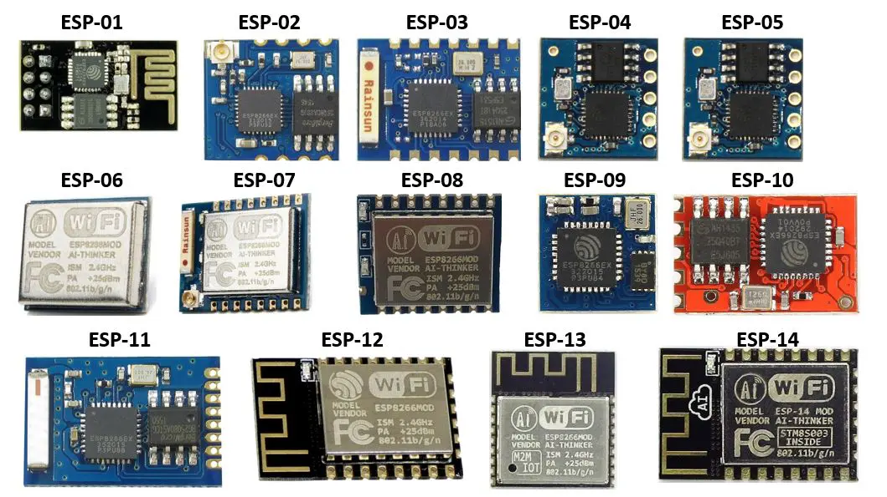
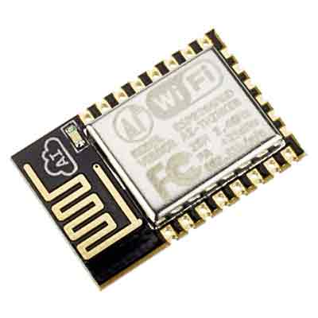

import { Aside } from '@astrojs/starlight/components';

`ESP8266` یک **SoC** (System on a Chip یا «سیستم روی تراشه») است که توسط شرکت چینی [اسپرسیف](https://www.espressif.com/) تولید می‌شود. در این نوع تراشه، چندین بخش مختلف در قالب یک مدار مجتمع واحد کنار هم قرار گرفته‌اند. مهم‌ترین این بخش‌ها شامل یک **پردازنده 32 بیتی** و یک **تراشه Wi-Fi** با قابلیت مدیریت **پشته پروتکل TCP/IP** هستند.

به‌طور خلاصه، `ESP8266` تراشه‌ای است که یک **پردازنده همه‌منظوره** را به همراه **اتصال کامل Wi-Fi** در یک بسته واحد ادغام می‌کند.

پردازنده‌ای که در `ESP8266` به‌کار رفته، یک پردازنده **Tensilica L106** با **معماری 32 بیتی RISC** است. این پردازنده به‌صورت پیش‌فرض با `80 MHz` کار می‌کند و حداکثر فرکانس کاری آن به `160 MHz` می‌رسد.

`ESP8266` حافظه **Flash** را در داخل خود تراشه (**SoC**) ندارد؛ بنابراین این حافظه باید روی **ماژولی** که تراشه روی آن نصب شده است، فراهم شود.

ارتباط بین تراشه و حافظه فلش از طریق رابط **QSPI** انجام می‌شود، اما در حالت معمول، استفاده از این رابط برای برنامه‌نویس کاملاً آسان است و نیازی به مدیریت مستقیم آن ندارد.

نکته مهمی که باید به آن توجه کرد این است که ظرفیت حافظه فلش به خود تراشه `ESP8266` وابسته نیست، بلکه به ماژولی که از آن استفاده می‌کنید بستگی دارد. معمولاً ماژول‌های مختلف با `1 MiB` تا `8 MiB` حافظه فلش عرضه می‌شوند و حداکثر ظرفیت پشتیبانی‌شده `16 MiB` است.

## تاریخچه ESP8266

بدون اینکه وارد جزئیات زیادی شویم، داستان `ESP8266` و برادر قدرتمندتر آن، `ESP32`، از **اوت ۲۰۱۴** آغاز می‌شود؛ زمانی که ماژول‌های `ESP-01` توسط شرکت [AI-Thinker](https://en.ai-thinker.com/) معرفی شدند.

در آن زمان، ارتباط با `ESP8266` از طریق **فرمان‌های AT** انجام می‌شد. مستندات بسیار محدود بودند و بیشتر آن‌ها به زبان چینی منتشر شده بودند. همچنین `SDK` رسمی پیچیده بود و استفاده از آن برای بسیاری از توسعه‌دهندگان آسان نبود؛ به همین دلیل، کاربرد این تراشه در ابتدا محدود به نظر می‌رسید. با این حال، این موضوع باعث نشد که علاقه‌مندان از پتانسیل بالای آن غافل شوند و به‌سرعت جامعه کاربری و تولیدکنندگان مختلف کار روی این تراشه را آغاز کردند.

یکی دیگر از نقاط عطف مهم، انتشار [NodeMCU](https://www.nodemcu.com/index_en.html) بود؛ نامی که هم به یک **فریمور** و هم به یک **برد توسعه** اشاره دارد. این فریمور امکان برنامه‌نویسی `ESP8266` را با زبان **Lua** فراهم می‌کرد؛ زبانی نیمه‌کامپایل‌شونده که بر پایه زبان‌های **C** و **Perl** توسعه یافته است.

فعالیت جامعه توسعه‌دهندگان همچنان ادامه پیدا کرد و به‌تدریج مستندات، آموزش‌ها و ابزارهای متنوعی برای `ESP8266` تولید شد. نتیجه این تلاش‌ها، شکل‌گیری یکی دیگر از مهم‌ترین نقاط عطف این تراشه بود: انتشار `SDK`های **متن‌باز (Open Source)** مبتنی بر **GCC Toolchain** که توسط جامعه توسعه‌دهندگان ارائه شدند.

این اتفاق باعث شد بتوان `ESP8266` را از طریق محیط `Arduino` و با استفاده از **ESP8266 Arduino Core** برنامه‌نویسی کرد. همین موضوع، سکوی پرتاب اصلی `ESP8266` در دنیای **Maker** بود؛ زیرا از این پس این تراشه می‌توانست از جامعه بسیار بزرگ کاربران و توسعه‌دهندگان آردوینو بهره‌مند شود.

شرکت [**اسپرسیف**](https://www.espressif.com/) نیز به این روند واکنش نشان داد (یا شاید بهتر است بگوییم ظرفیت بالای این پروژه را تشخیص داد یا تصمیم گرفت از جامعه توسعه‌دهندگان حمایت کند) و نسخه‌های جدیدی از `SDK` را با مجوزی مشابه `MIT` منتشر کرد که عملاً پشتیبانی رسمی بیشتری از جامعه کاربران فراهم می‌کرد.

از آن زمان تاکنون، تولیدکنندگان متعددی بردهای توسعه‌ای مبتنی بر `ESP8266` عرضه کرده‌اند. از مشهورترین آن‌ها می‌توان به [NodeMCU](https://www.nodemcu.com/index_en.html) و [WeMos](https://www.wemos.cc/en/latest/) اشاره کرد که هرکدام در مدل‌ها و نسخه‌های مختلفی تولید شده‌اند. در ادامه این بردها را نیز بررسی خواهیم کرد.

امروزه `SDK`ها و **فریمور**های متنوعی برای `ESP8266` در دسترس هستند که امکان برنامه‌نویسی این تراشه را با زبان‌های مختلف فراهم می‌کنند. برای مثال می‌توان به [MicroPython](https://micropython.org/) (برای زبان **Python**)، [Espruino](https://www.espruino.com/) (برای **JavaScript**)، [ESP-OPEN-RTOS](https://github.com/SuperHouse/esp-open-rtos) (مبتنی بر **FreeRTOS**) و [Mongoose OS](https://mongoose-os.com/) اشاره کرد. در مطالب بعدی با این گزینه‌ها نیز بیشتر آشنا خواهیم شد.

در **سپتامبر ۲۰۱۶**، `ESP32` معرفی شد؛ تراشه‌ای که نسبت به `ESP8266` پیشرفت چشمگیری داشت و بسیاری از محدودیت‌های آن را برطرف می‌کرد. قیمت `ESP32` کمی بیشتر است، اما اگر `ESP8266` را تراشه‌ای قدرتمند و جذاب بدانیم، `ESP32` واقعاً یک هیولاست. هرچند میزان مستندات و پشتیبانی موجود برای `ESP32` در ابتدا کمتر بود، اما این وضعیت با سرعت زیادی در حال بهبود است. در مطالب آینده به معرفی `ESP32` و قابلیت‌های آن نیز خواهیم پرداخت.

## انواع ماژول‌های مبتنی بر ESP8266

ماژول‌های مختلفی وجود دارند که در آن‌ها `ESP8266` به‌کار رفته است. ویژگی‌های اصلی این ماژول‌ها تقریباً مشابه هستند و تفاوت آن‌ها بیشتر در **مقدار حافظه Flash در دسترس** و **شکل فیزیکی (Form Factor)** آن‌هاست؛ موضوعی که به‌طور مستقیم روی تعداد **پین‌های GPIO قابل دسترس** نیز تأثیر می‌گذارد.

در بعضی از بردها (که تعدادشان کمتر است)، پین‌های `GPIO` به‌صورت کامل و استاندارد (Pin Header) در دسترس هستند؛ به این ترتیب می‌توان به‌راحتی سیم‌کشی انجام داد یا آن‌ها را به ترمینال‌ها متصل کرد.

اما در بیشتر ماژول‌ها، پین‌ها به شکل **نیم‌پین (Half-pin)** طراحی شده‌اند. این طراحی به این دلیل است که این ماژول‌ها اصولاً برای **قرار گرفتن روی بردهای PCB یا بردهای توسعه (Development Boards)** و لحیم‌کاری مستقیم روی آن‌ها ساخته شده‌اند.

برای ساده‌سازی، در یک جمع‌بندی می‌توان گفت که رایج‌ترین ماژول‌ها `ESP-01` و `ESP-12` هستند و سایر مدل‌ها نسبتاً کمتر دیده می‌شوند.

<Aside type='tip'>
ماژول `ESP-01` به چند دلیل بسیار محبوب است: از جمله اینکه جزو اولین ماژول‌هایی بود که عرضه شد، اندازه بسیار کوچکی دارد و قیمت آن پایین است.
با این حال، می‌توان از آن در پروژه‌هایی استفاده کرد که به تعداد کمی `GPIO` نیاز دارند، زیرا فقط ۲ پایه `GPIO` قابل استفاده در اختیار قرار می‌دهد.
</Aside>

با این حال، `ESP-12` و `ESP-12E` به‌تدریج به مدل‌های ترجیحی و استانداردتر در میان ماژول‌های `ESP8266` تبدیل شده‌اند و امروزه روی تعداد زیادی از **بردهای توسعه (Development Boards)** و همچنین محصولات تجاری نصب و استفاده می‌شوند.

